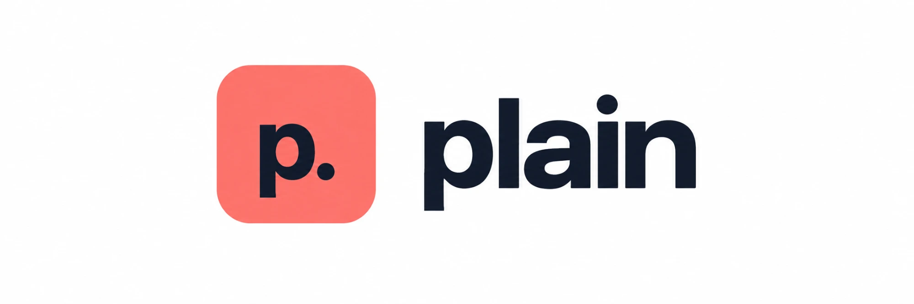

<p align="center">
  
</p>

<p align="center">
  <a href="LICENSE"></a>
  
  
</p>

Write browser, desktop and mobile tests in plain English. Run the YAML specs from the command line. Or let a
coding agent explore a flow through MCP and save it as a spec.

[Jev](https://typesafe.ai), a small decision model, selects the element that a target describes and judges each
claim. Jev reads the accessibility tree, not screenshots. Playwright, xa11y or Appium do the actions.

https://github.com/user-attachments/assets/87fdc301-93af-40bf-b19d-3637689e5c98

<p align="center"><sub>plain, explained in 6 minutes: plain-English specs, how Jev picks and judges, the three engines,
agent mode, run modes and lock files, what Jev costs, and how it compares with a classic test framework.</sub></p>

| | Browser | Desktop | Mobile |
|---|---|---|---|
| Plugin and CLI | `plain` | `plain-computer` | `plain-mobile` |
| Actions by | [Playwright](https://playwright.dev) | [xa11y](https://xa11y.dev) | [Appium](https://appium.io) |
| Spec target | `url`: a website | `app`: a running application | `platform`, `device`, `app`: an installed app |
| Platforms | Chromium or Chrome | macOS (tested), Windows, Linux | iOS, Android, React Native |

## Quick start

You need Node 22 or newer, npm, and a [TypeSafe](https://typesafe.ai) API key (a Vercel AI Gateway key also works).

1. Put the key in `~/.config/plain/.env`. All plugins and CLIs read this file.

   ```dotenv
   TYPESAFE_API_KEY=<your key>
   ```

2. Install the browser plugin in your coding agent. In Claude Code:

   ```sh
   /plugin marketplace add gabe4coding/plain
   /plugin install plain@plain-marketplace
   ```

   In Codex:

   ```sh
   codex plugin marketplace add gabe4coding/plain
   codex plugin add plain@plain-marketplace
   ```

3. To run a spec from the command line, save the spec in [A spec](#a-spec) as `todo.yaml`. Then run it with
   npx. On the first run, npx installs the
   [`@gabe4coding/plain` npm package](https://www.npmjs.com/package/@gabe4coding/plain) and plain installs
   Chromium.

   ```sh
   npx -p @gabe4coding/plain plain todo.yaml
   ```

[Getting started](docs/getting-started.mdx) shows the desktop and mobile plugins, the key options and all
environment variables.

## A spec

A spec names its target and lists its steps. A browser spec starts with `goto`: `url` is only the base for `goto`.

```yaml
name: add a todo
url: https://demo.playwright.dev/todomvc
steps:
  - goto: /
  - fill: { target: "the new todo input", value: "buy milk" }
  - press: Enter
  - expect: "a todo item named 'buy milk' is listed"
```

Describe each element by its role and visible text. Write each claim as a specific statement about the
current state. The [phrasing guide](docs/phrasing.mdx) shows how.

In a [comparison on six browser workflows](docs/performance.mdx), an agent with plain used 25–52% less
time than with Playwright MCP. The API cost changed from 24% lower to 7% higher, by model.

## Documentation

| Guide | Contents |
|---|---|
| [Getting started](docs/getting-started.mdx) | Requirements, API key, plugin install, first specs, environment variables. |
| [Spec reference](docs/spec-reference.mdx) | Spec format, browser steps, reusable flows, browser context, login state. |
| [Phrasing](docs/phrasing.mdx) | Targets, claims, thresholds, inconclusive results. |
| [Hooks](docs/hooks.mdx) | Setup and teardown, test data in `${hooks.*}`. |
| [Running suites](docs/running.mdx) | CLI flags, config file, selection, retries, run modes, exit codes. |
| [Reporting](docs/reporting.mdx) | Text, JSONL, JUnit and JSON output. |
| [Artifacts](docs/artifacts.mdx) | Screenshots, traces, debug dumps. |
| [CI and containers](docs/ci.mdx) | GitHub Action, GitLab, Docker. |
| [Agent mode](docs/agent-mode.mdx) | Browser MCP tools, `save`, your real browser. |
| [Snapshots](docs/snapshots.mdx) | Raw, compact and smart snapshot modes. |
| [Desktop](docs/computer-use.mdx) | Desktop setup, permissions, specs and tools. |
| [Mobile](docs/mobile-use.mdx) | Appium setup, mobile specs, gestures and tools. |
| [Performance](docs/performance.mdx) | Measured cost and speed, links to the benchmark reports. |
| [Development](docs/development.mdx) | Build, tests, native smoke tests, plugin packaging. |

## Usage rules

- Use plain on test environments only. Stop before the last irreversible step: payment, booking, sending.
- Do not put literal credentials in a spec. Use environment references or hooks.
- Do not use plain to bypass bot protection.

## License

[MIT](LICENSE)
