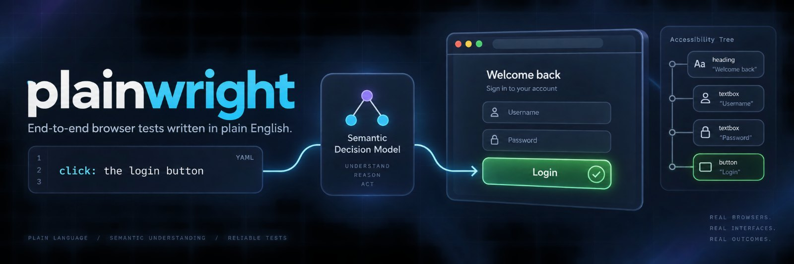

<p align="center">
  
</p>

<p align="center">
  <a href="LICENSE"></a>
  
  
</p>

Browser, desktop and mobile automation written in plain English. Run YAML tests from the command line,
or let a coding agent explore a flow through MCP and save it as a replayable spec.

[Jev](https://typesafe.ai), a small decision model, selects the element a sentence describes and
judges whether a claim holds. It reads accessibility text; the automation backend performs the actions.

https://github.com/user-attachments/assets/cd3eecfc-91de-4ac9-a4cf-44300cf5ccc2

<p align="center"><sub>plainwright, explained in 6 minutes: plain-English specs, how Jev picks and judges, the three engines,
agent mode, the pick cache, what Jev costs, and how it compares with a classic test framework.</sub></p>

| | Browser | Desktop | Mobile |
|---|---|---|---|
| Plugin and CLI | `plainwright` | `plainwright-computer` | `plainwright-mobile` |
| Action backend | [Playwright](https://playwright.dev) | [xa11y](https://xa11y.dev) | [Appium](https://appium.io) + WebdriverIO |
| Spec target | `url`: a website | `app`: a running native application | `platform`, `device`, `app`: installed iOS/Android app |
| Platforms | Playwright-supported platforms | macOS, Windows and Linux API; native verification currently targets macOS | iOS/XCUITest and Android/UiAutomator2, including React Native; native validation required on target devices |

All engines share Jev decisions, assertions, environment interpolation, and setup/teardown hooks
through adapters. Native targeting requires accessible controls; screenshots are available for
inspection but are not supplied to Jev.

## Get started

Requirements: Node 22+, npm, and a [TypeSafe](https://typesafe.ai) API key or Vercel AI Gateway key.

Create `~/.config/plainwright/.env` with your provider key. All plugins and CLIs read this file:

```dotenv
TYPESAFE_API_KEY=<your key>
```

For desktop use, start the application before attaching. On macOS, grant the host running Node
Accessibility permission and Screen Recording permission for screenshots, then restart the host if
required. Windows needs an interactive UI Automation desktop; Linux needs an AT-SPI2-enabled desktop.
See [platform setup](docs/computer-use.md#platform-setup) for prerequisites and limitations.

For mobile, start Appium with XCUITest or UiAutomator2 and connect a test device or boot a
simulator/emulator with your app installed. See [mobile setup](docs/mobile-use.md#setup).

### Use with an agent

Add the marketplace, then install the plugins you need. Each includes an MCP server and a skill
that teaches the agent how to phrase actions, inspect results, and save a flow.

**Claude Code**

```sh
/plugin marketplace add gabe4coding/plainwright
/plugin install plainwright@plainwright-marketplace
/plugin install plainwright-computer@plainwright-marketplace
/plugin install plainwright-mobile@plainwright-marketplace
```

**Codex**

```sh
codex plugin marketplace add gabe4coding/plainwright
codex plugin add plainwright@plainwright-marketplace
codex plugin add plainwright-computer@plainwright-marketplace
codex plugin add plainwright-mobile@plainwright-marketplace
```

The first use installs the shared runtime dependencies. The browser plugin also installs Chromium.
Each server keeps one session, and the agent sends natural-language actions through `step`.

| Tools | Available in |
|---|---|
| `open`, `step`, `find`, `snapshot`, `ask`, `read`, `save` | All plugins (`ask`: yes/no questions about the current state, not recorded; `read`: answers a question with the on-screen tree lines, not recorded) |
| `evaluate` | Browser: read a JavaScript expression's value |
| `batch` | Browser: run up to 16 known steps in order, stopping on the first non-pass |
| `apps` | Desktop: list running apps |
| `list_devices`, `list_apps` | Mobile: discover local devices and installed apps |
| `screenshot`, `close` | Desktop and mobile: capture native UI and release the session |

Use `save` to turn successful steps into a YAML spec. Desktop `open` attaches to a running app;
`close` leaves it running. For tool arguments and session behavior, see
[browser agent mode](docs/agent-mode.md), [desktop agent tools](docs/computer-use.md#agent-tools),
and [mobile agent tools](docs/mobile-use.md#agent-tools).

For UI discovery, opt into `snapshot {mode:"compact"}` for selected exact excerpts or
`snapshot {mode:"smart",intent:"the task"}` for Jev classifications and only task-relevant UI
regions, necessary context, and recognized critical messages.
Raw remains the default; see [snapshot views and tradeoffs](docs/snapshots.md).

### Measured browser costs and speed

In a [108-trial whole-workflow comparison](docs/benchmarks/current-browser-comparison.md),
current plainwright used **24% less API cost with Terra and 10% less with Astra**, while Luna
cost **7% more**, than Playwright MCP 0.0.82. Mean elapsed time was **25–52% lower**.
These are observed results on six synthetic browser workflows, not a general website guarantee.

| Main model | API cost per task: plainwright / Playwright MCP | Cost change | Mean seconds: plainwright / Playwright MCP | Time change |
|---|---:|---:|---:|---:|
| GPT-5.6 Luna (small) | $0.001344 / $0.001262 | +7% | 17.0 / 35.4 | −52% |
| GPT-5.6 Terra (medium) | $0.010184 / $0.013374 | −24% | 17.0 / 22.9 | −25% |
| GPT-6 Astra (top) | $0.044577 / $0.049695 | −10% | 20.4 / 41.8 | −51% |

Costs include main-agent and Jev usage, caching, recovery and verification. Luna and Astra's
95% task-cluster cost intervals include parity; Terra's is 0.66–0.91×. Astra account editing
still cost 20% more, and Terra catalog browsing was 54% slower. Main-agent calls fell **19%**
(333 versus 412). Timing includes provider latency and each stack's browser waiting behavior.

Both stacks reached the requested values or answer in 54/54 trials. Plainwright passed all
54 strict oracle checks; the baseline passed 53 because it saved the correct account twice.
The fixture resets its display on reload, so this is not evidence of a wrong-account edit or
a general reliability advantage. Excluding that entire pair still leaves Terra **20% cheaper**.
All 108 trials had complete usage accounting and finished naturally. Three repetitions per
workflow/model are insufficient to establish production reliability.

The [full report and audit](docs/benchmarks/2026-09-21-current/README.md) retain every trial,
per-task results, intervals, costs per success and traces. The comparison fixes an artifact-reader
bug that restricted snapshot-file access in the earlier baseline experiments; those historical
reports are marked accordingly. The separate [batching ablation](docs/benchmarks/browser-batching.md)
compares two Jev-assisted configurations and is not evidence of savings against Playwright MCP.
See the [protocol and reproduction instructions](docs/benchmarks/browser-workflows.md).
That comparison predates the [step-overhead work](docs/benchmarks/step-overhead.md), which cut
per-step waiting by 43% in spec runs and MCP tool time by 43% in an agent-style session.

### Run from a checkout

```sh
git clone https://github.com/gabe4coding/plainwright.git
cd plainwright
```

Run the included browser example. The launcher installs dependencies and Chromium on first use,
then opens a visible browser:

```sh
node bin/plainwright.mjs examples/todo.yaml
```

For desktop specs, install the shared dependencies first, then run a spec targeting an open app:

```sh
npm ci
node bin/plainwright-computer.mjs path/to/desktop.yaml
```

To connect an MCP client directly, start the corresponding server over stdio:

```sh
node bin/plainwright.mjs --headless mcp
node bin/plainwright-computer.mjs mcp
node bin/plainwright-mobile.mjs mcp
```

## Write a spec

A spec names its target and lists actions or checks. Describe controls by their accessibility role
and visible text, and write assertions as specific claims about the current state.

### Browser

```yaml
name: add a todo
url: https://demo.playwright.dev/todomvc
steps:
  - goto: /
  - fill: { target: "the new todo input", value: "buy milk" }
  - press: Enter
  - expect: "a todo item named 'buy milk' is listed"
```

Browser steps include navigation, dropdown selection, file upload, and a `css=` escape hatch.
See the [browser spec reference](docs/spec-reference.md) for all steps and top-level settings.

### Desktop

This example assumes a test app named `Desktop Test Fixture` is already running with the described
controls. Replace its name and targets to match your application:

```yaml
name: preview a message
app: Desktop Test Fixture
steps:
  - fill: { target: "the Message text field", value: "hello" }
  - check: "the Enable preview checkbox"
  - click: "the Preview button"
  - expect: "The preview says hello"
```

Desktop specs use `app` in place of `url`. Browser-only steps such as `goto`, `select`, `upload`,
and `css=` are rejected. See [desktop specs](docs/computer-use.md#desktop-specs) for supported steps.

### Mobile

The mobile MCP can discover local Android devices/emulators and iOS simulators with
`list_devices`, then find installed app IDs with `list_apps {platform, device, query?}`.
These tools work before `open` and require no model key. Discovery uses the MCP host's SDKs;
physical iPhones and remote Appium hosts still require explicit device/app IDs.

Mobile specs target an installed app by package/bundle ID and an explicit device ID. For example,
on an Android test emulator with your fixture installed:

```yaml
name: preview a mobile message
platform: android
device: emulator-5554
app: com.example.fixture
steps:
  - fill: {target: "the Message text field", value: "hello"}
  - tap: "the Preview button"
  - expect: "The preview says hello"
```

For iOS use `platform: ios`, the simulator/device UDID and app bundle ID. Run with
`node bin/plainwright-mobile.mjs path/to/mobile.yaml`. Mobile adds `tap`, `longpress` and `swipe`;
see [mobile specs](docs/mobile-use.md#mobile-specs) for gestures, platform differences and hooks.

Runnable [Android](examples/mobile/android.yaml) and [iOS Simulator](examples/mobile/ios.yaml)
examples build and install their own disposable native fixtures through hooks. Follow the
[example setup and commands](examples/mobile/README.md) to run them against your test device.

### Shared behavior

All engines support actions such as `click`, `fill`, `check`, and `press`, plus `wait` and `expect`
for assertions. `optional: true` skips an action that errors or is inconclusive; a definite failed
assertion still fails the run.

Keep credentials outside specs: reference `$VAR` in an `env` block and use `${env.*}` in steps.
[Hooks](docs/hooks.md) can prepare and release test data, exposing setup results as `${hooks.*}`.
The [phrasing guide](docs/phrasing.md) explains target selection, judgment thresholds, and how to
resolve an inconclusive result.

Top-level `examples/*.yaml` are browser specs against public demo sites; `examples/mobile/` contains
disposable native fixtures and recorded app flows with documented starting conditions. `examples/login-fails.yaml` is intended
to fail.

## Run options and results

All CLIs accept files, directories, or quoted globs. Browser specs can run concurrently;
desktop and mobile run sequentially because they share one input stream.

```sh
node bin/plainwright.mjs validate tests/
node bin/plainwright.mjs --headless --tag smoke --retries 1 tests/
```

| Group | Option | Purpose / default |
| --- | --- | --- |
| Running | `--timeout MS` | Per-action timeout: `15000`; browser `0` disables it, native requires a positive value. |
| Running | `--spec-timeout MS` | Whole-attempt budget; unset by default, spec `timeout:` wins. |
| Running | `--workers N` | `1`; concurrent isolated browser contexts. Desktop/mobile, `--profile`, and `--cdp` require `1`. |
| Running | `--retries N` | Additional attempts after non-pass: `0`. A retry pass is flaky and counts as passing. |
| Running | `--bail [N]` | Stop starting specs after N final non-passes; bare flag means `1`, default `0` disables. |
| Running | `--max-tokens N` | Stop starting specs/retries after completed attempts reach this token budget; unset by default. |
| Running | `--headless` | Browser only: hide the window; visible by default. |
| Running | `--profile DIR` | Browser only: persistent profile folder. |
| Running | `--channel chrome` | Browser only: use installed Chrome; works with `--profile`. |
| Running | `--cdp URL` | Browser only: attach to an existing Chrome debugging session. |
| Running | `--server URL` | Mobile only: Appium URL; default `http://127.0.0.1:4723`. |
| Running | `--picks MODE` | Pick cache: `on` (default) reuses and stores Jev's picks in `*.picks.json` next to the specs, `read` never writes, `off` always asks Jev. |
| Selection | `--grep RE`, `--grep-invert RE` | Include/exclude a case-sensitive regex on the name or cwd-relative path. |
| Selection | `--tag T` | Repeatable; require all tags. No tag filter by default. |
| Selection | `--last-failed` | Intersect selection with the previous run’s non-pass files. |
| Selection | `--list` | List selected specs without a model key or session; still requires spec `$VAR` values. |
| Invocation | `--config FILE` | Use this config instead of cwd `plainwright.config.yaml`/`.yml`. |
| Invocation | `validate <paths...>` | Check every supplied spec and include without sessions, hooks or a model key. |
| Reports | `--reporter NAME[:FILE]` | Repeatable; `text`, `jsonl`, `junit:FILE`, `json:FILE`. Default browser `text`, native `jsonl`. |
| Reports | `--timing` | Browser only: print phase timings with the text reporter. |
| Artifacts | `--artifacts DIR` | Enable capture in a dedicated output folder; off by default. |
| Artifacts | `--screenshot MODE` | `off`, `on-failure`, `always`; default `on-failure` when capture is enabled. |
| Artifacts | `--trace MODE` | Browser: same modes, default `on-failure`; native: `off` only when capture is enabled. |

See [running suites](docs/running.md) for selection, config, retries and stop rules,
and [your real browser](docs/agent-mode.md#your-real-browser) for profile and attachment setup.
The browser defaults to `✔` pass, `✘` fail/error, `?` inconclusive and `»` skipped output;
desktop/mobile default to one JSON line per executed spec. Exit `0` means all reported specs
pass (including flaky passes or an empty selection), `1` means a non-passing result or load
error, and `2` means invocation/config/provider error.

## Configuration

Suite runs discover `plainwright.config.yaml` (or `.yml`) in the current directory;
`--config FILE` selects another file. It can set default paths, workers, retries,
selection, reporters and artifacts. CLI flags override the existing `PLAINWRIGHT_*`
settings, which override config, then defaults. MCP does not read suite config.
See the [config key table](docs/running.md#configuration).

All engines read the shell environment, then a `.env` in the current directory (see
[.env.example](.env.example)), then `~/.config/plainwright/.env`. A variable already set is never
overridden.

| Variable | Applies to | Meaning |
|---|---|---|
| `TYPESAFE_API_KEY` | All | TypeSafe direct, the default backend. Wins when both provider keys are set. |
| `AI_GATEWAY_API_KEY` | All | Use Vercel AI Gateway. |
| `JEV_PROVIDER` | All | Force `typesafe` or `gateway`. |
| `PLAINWRIGHT_CHANGES` | All | Step results carry `changed` (title and URL if they changed, new accessibility-tree lines capped at 1,500 characters, and a removed count). On by default; set to `0` to turn it off. |
| `PLAINWRIGHT_READ` | All | `read` answers a question with the page's own lines. On by default; set to `0` to hide it. |
| `PLAINWRIGHT_PROFILE` | Browser | Same as `--profile`. |
| `PLAINWRIGHT_CHANNEL` | Browser | Same as `--channel`. |
| `PLAINWRIGHT_CDP` | Browser | Same as `--cdp`. |
| `PLAINWRIGHT_APPIUM_URL` | Mobile | Appium URL; `--server` overrides it. Default `http://127.0.0.1:4723`. |

The browser environment settings also let a plugin use your preferred profile or running browser
without changing its launch arguments. Jev is pinned to a tested version (`jev-1.13.0` on TypeSafe)
because the decision thresholds and phrasing advice were tuned against it.

## Documentation

| Guide | Contents |
|---|---|
| [Browser spec reference](docs/spec-reference.md) | Steps, tags, timeouts, reusable flows, browser context and stored login state. |
| [Browser agent mode](docs/agent-mode.md) | MCP tools, plugin setup, persistent profiles and Chrome attachment. |
| [Computer use](docs/computer-use.md) | Native setup, desktop steps and tools, backend comparison and platform limitations. |
| [Mobile use](docs/mobile-use.md) | Appium setup, iOS/Android steps, MCP authoring and native validation. |
| [Phrasing](docs/phrasing.md) | Targets, claims, confidence thresholds and inconclusive results. |
| [Hooks](docs/hooks.md) | Isolated setup/teardown and test-data interpolation. |
| [Running suites](docs/running.md) | Workers, retries, bail, token budgets, selection, config and validation. |
| [Reporting](docs/reporting.md) | Text, JSONL, JUnit and JSON formats, totals and flaky passes. |
| [Artifacts](docs/artifacts.md) | Failure screenshots, browser traces, debug dumps and cleanup. |
| [CI and containers](docs/ci.md) | GitHub Action, GitLab and Docker setup. |

## Usage rules

- Test environments only. Stop before the last irreversible step: payment, booking, sending.
- No literal credentials in a spec. Use environment references or hooks.
- Never use it to bypass bot protection.

## Development

```sh
npm ci
npx playwright install chromium
npm test                  # build + browser, desktop and mobile tests; no API key needed
npm run build             # regenerate dist/ and all plugin runtime archives
npm run test:computer:mac  # opt-in native smoke using a disposable Cocoa fixture
npm run test:mobile        # opt-in Appium tree/PNG smoke; see mobile guide for env setup
npm run test:mobile:android # opt-in disposable Android fixture, MCP recording and replay
npm run test:mobile:ios     # opt-in disposable iOS Simulator fixture, MCP recording and replay
```

The desktop native smoke requires macOS Accessibility and Screen Recording permissions; desktop
Windows and Linux still need native verification on their own hosts. Mobile smoke tests require
the SDKs, running devices and Appium drivers described in the [mobile guide](docs/mobile-use.md#verification).

One root `package.json` and `package-lock.json` own all engines:

```text
package.json                 shared dependencies, CLI binaries and build
src/                         browser, desktop, mobile and shared adapters
dist/                        compiled runtime
plugins/
  plainwright/               browser manifests, skill and launcher
  plainwright-computer/      desktop manifests, skill and launcher
  plainwright-mobile/        mobile manifests, skill and launcher
```

Each plugin includes portable, Claude Code, and Codex compatibility manifests. Both root marketplaces
point at these directories. The build copies the same `runtime.tgz` into each plugin, with a shrinkwrap
derived from the root lockfile. Each plugin installs it into an ignored `.runtime/` cache on first use
and can run independently.

Compiled output and plugin archives are committed; rebuild after source changes.
[CLAUDE.md](CLAUDE.md) describes the architecture and contributor conventions.

## License

[MIT](LICENSE)
