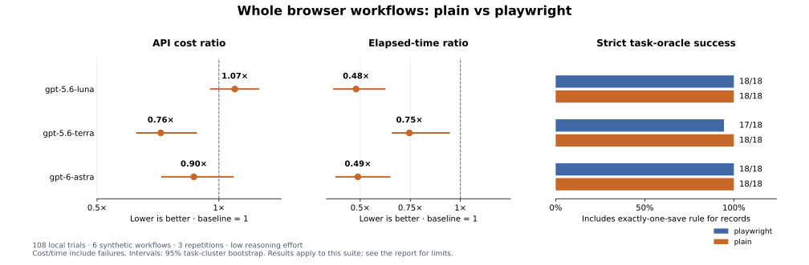

# Browser workflow results — 2026-09-21

108 trials; 6 synthetic workflows, 3 repetitions, two tool configurations and 3 main models. Total recorded API cost: **$2.1679**. Development pilots and the benchmarking agent’s own work are excluded.

See the [protocol and reproduction instructions](../browser-workflows.md). These are measurements of this harness and task suite, not a general website-performance guarantee.

Read the [interpretation and failure analysis](findings.md).

## Full-sample results

All trials, including failures, contribute to cost and time. Success means the independent task oracle passed. Successful natural completions additionally require the agent to finish before a limit/error.

| Main model | Stack | Oracle successes | Successful natural completions | Mean cost/task | Cost/success (failures included) | Mean seconds | Median seconds | p95 seconds |
|---|---|---:|---:|---:|---:|---:|---:|---:|
| gpt-5.6-luna | playwright | 18/18 | 18/18 | $0.001262 | $0.001262 | 35.4 | 32.2 | 69.3 |
| gpt-5.6-luna | plainwright | 18/18 | 18/18 | $0.001344 | $0.001344 | 17.0 | 15.7 | 28.4 |
| gpt-5.6-terra | playwright | 17/18 | 17/18 | $0.013374 | $0.014160 | 22.9 | 22.1 | 35.8 |
| gpt-5.6-terra | plainwright | 18/18 | 18/18 | $0.010184 | $0.010184 | 17.0 | 16.4 | 24.0 |
| gpt-6-astra | playwright | 18/18 | 18/18 | $0.049695 | $0.049695 | 41.8 | 34.1 | 79.6 |
| gpt-6-astra | plainwright | 18/18 | 18/18 | $0.044577 | $0.044577 | 20.4 | 19.2 | 27.8 |

## Paired comparisons

Ratios are plainwright / playwright. Below 1 means lower cost or less elapsed time. Intervals resample task types, preserving repetitions and pairs; they are descriptive and based on a small suite.

| Main model | Cost ratio [95% interval] | Time ratio [95% interval] | Cost ratio, both succeeded | Time ratio, both succeeded |
|---|---:|---:|---:|---:|
| gpt-5.6-luna | 1.07× [0.97×, 1.16×] | 0.48× [0.37×, 0.62×] | 1.07× | 0.48× |
| gpt-5.6-terra | 0.76× [0.66×, 0.91×] | 0.75× [0.66×, 0.94×] | 0.80× | 0.78× |
| gpt-6-astra | 0.90× [0.77×, 1.06×] | 0.49× [0.38×, 0.65×] | 0.90× | 0.49× |

## Usage and cost sensitivity

Main-agent input totals include repeatedly supplied conversation context. Cached reads and writes are subsets of that input. Output includes reasoning. The uncached column is a hypothetical repricing of measured usage, not a second experiment.

| Main model | Stack | Main calls | Browser/helper calls | Main input | Cache reads | Cache writes | Main output | Reasoning | Jev calls | Jev input | Jev cost | Hypothetical uncached mean cost |
|---|---|---:|---:|---:|---:|---:|---:|---:|---:|---:|---:|---:|
| gpt-5.6-luna | playwright | 137 | 123 | 345714 | 303868 | 41435 | 5160 | 821 | 0 | 0 | $0.000000 | $0.004185 |
| gpt-5.6-luna | plainwright | 112 | 94 | 278263 | 248714 | 29213 | 5177 | 906 | 101 | 134188 | $0.005636 | $0.003750 |
| gpt-5.6-terra | playwright | 143 | 127 | 389183 | 344997 | 43757 | 5123 | 863 | 0 | 0 | $0.000000 | $0.046658 |
| gpt-5.6-terra | plainwright | 113 | 95 | 276895 | 248782 | 27774 | 4819 | 637 | 101 | 133757 | $0.005618 | $0.034291 |
| gpt-6-astra | playwright | 132 | 114 | 302748 | 266982 | 35370 | 3629 | 0 | 0 | 0 | $0.000000 | $0.178274 |
| gpt-6-astra | plainwright | 108 | 90 | 268312 | 236709 | 31279 | 3368 | 0 | 70 | 72756 | $0.003056 | $0.158588 |

## Where elapsed time goes

Means per trial. Model time includes API latency and inference; tool time includes browser work and Jev calls. Different tool stacks and provider latency both affect the observed speed; this is not an isolated measure of Jev inference speed.

| Main model | Stack | Main-model seconds | Browser/helper seconds |
|---|---|---:|---:|
| gpt-5.6-luna | playwright | 28.4 | 7.0 |
| gpt-5.6-luna | plainwright | 12.9 | 4.0 |
| gpt-5.6-terra | playwright | 15.5 | 7.3 |
| gpt-5.6-terra | plainwright | 12.9 | 4.1 |
| gpt-6-astra | playwright | 34.8 | 6.9 |
| gpt-6-astra | plainwright | 16.9 | 3.5 |

## Tasks: gpt-5.6-luna

Treatment: plainwright; control: playwright.

| Task | Successes: treatment / control | Mean cost: treatment / control | Mean seconds: treatment / control |
|---|---:|---:|---:|
| contact | 3/3 / 3/3 | $0.000874 / $0.000684 | 12.1 / 31.1 |
| preferences | 3/3 / 3/3 | $0.001011 / $0.001155 | 14.4 / 44.5 |
| catalog | 3/3 / 3/3 | $0.001531 / $0.001584 | 11.0 / 15.1 |
| record | 3/3 / 3/3 | $0.002121 / $0.001792 | 27.5 / 39.7 |
| wizard | 3/3 / 3/3 | $0.001272 / $0.001228 | 16.7 / 47.4 |
| validation | 3/3 / 3/3 | $0.001254 / $0.001126 | 20.1 / 34.5 |

## Tasks: gpt-5.6-terra

Treatment: plainwright; control: playwright.

| Task | Successes: treatment / control | Mean cost: treatment / control | Mean seconds: treatment / control |
|---|---:|---:|---:|
| contact | 3/3 / 3/3 | $0.007075 / $0.006869 | 12.8 / 16.9 |
| preferences | 3/3 / 3/3 | $0.008065 / $0.008565 | 13.6 / 19.0 |
| catalog | 3/3 / 3/3 | $0.008822 / $0.015853 | 14.5 / 9.4 |
| record | 3/3 / 2/3 | $0.016964 / $0.024174 | 21.5 / 34.0 |
| wizard | 3/3 / 3/3 | $0.010239 / $0.013379 | 19.1 / 28.8 |
| validation | 3/3 / 3/3 | $0.009940 / $0.011402 | 20.6 / 28.8 |

## Tasks: gpt-6-astra

Treatment: plainwright; control: playwright.

| Task | Successes: treatment / control | Mean cost: treatment / control | Mean seconds: treatment / control |
|---|---:|---:|---:|
| contact | 3/3 / 3/3 | $0.028400 / $0.031017 | 17.0 / 26.7 |
| preferences | 3/3 / 3/3 | $0.033113 / $0.035468 | 16.7 / 40.5 |
| catalog | 3/3 / 3/3 | $0.052442 / $0.075555 | 15.4 / 21.0 |
| record | 3/3 / 3/3 | $0.068737 / $0.057425 | 26.3 / 36.5 |
| wizard | 3/3 / 3/3 | $0.042359 / $0.051420 | 23.1 / 74.5 |
| validation | 3/3 / 3/3 | $0.042413 / $0.047288 | 23.9 / 51.4 |

## Limits and evidence

- Non-natural terminations: 0. None.
- Trials with incomplete usage accounting: 0. All calls had usable accounting.
- Trials containing an output-capped generation (4,096 tokens): 0. None. Malformed calls and their recovery costs remain in the primary results. These can reflect model/tool-schema integration, not just UI targeting.
- Production behavior was frozen during the run. Failures, recoveries and expensive outliers remain in the sample.
- This suite has no authentication, CAPTCHA, real network-dependent application data, visual-only controls, mobile or desktop automation. It does not test direct Playwright code generation or CLI/skills agents.
- Model aliases, API load, caching, machine conditions and prompts can change the results. Repetitions per task: 3; this does not establish a production reliability rate.
- Costs use reported gateway charges plus measured Jev input tokens at its published rate. They exclude local hardware, subscriptions, taxes and setup.

Artifacts: [summary](summary.json), [per-trial measurements](runs.jsonl), [manifest and exact prompts](manifest.json), [pricing snapshot](pricing.json), [compressed traces](traces.jsonl.gz), and [SHA-256 checksums](sha256.json). Host home/temp prefixes in paths are sanitized; measured usage and costs are preserved.

## Sensitivity: pairs without an output-capped generation

This diagnostic excludes **both** arms of a pair if either reached the generation output cap. It is not the headline sample. It shows whether generation failures dominate the comparison.

| Main model | Remaining trials | Cost ratio | Time ratio |
|---|---:|---:|---:|
| gpt-5.6-luna | 36 | 1.07× | 0.48× |
| gpt-5.6-terra | 36 | 0.76× | 0.75× |
| gpt-6-astra | 36 | 0.90× | 0.49× |

## Sensitivity: successful, naturally completed pairs with complete usage

This diagnostic retains a pair only when both arms succeeded, finished naturally and have complete usage. The full sample above retains every trial; this filtered subset is not a replacement for it.

| Main model | Remaining pairs | Cost ratio | Time ratio |
|---|---:|---:|---:|
| gpt-5.6-luna | 18 | 1.07× | 0.48× |
| gpt-5.6-terra | 17 | 0.80× | 0.78× |
| gpt-6-astra | 18 | 0.90× | 0.49× |
