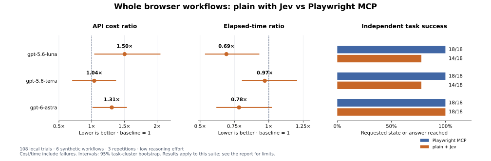

# Browser workflow results — 2026-09-21

108 trials; 6 synthetic workflows, 3 repetitions, two tool stacks and 3 main models. Total recorded API cost: **$2.6115**. Development pilots and the benchmarking agent’s own work are excluded.

See the [protocol and reproduction instructions](../browser-workflows.md). These are measurements of this harness and task suite, not a general website-performance guarantee.

Read the [interpretation and failure analysis](findings.md).

## Full-sample results

All trials, including failures, contribute to cost and time. Success means the independent task oracle passed. Natural completions additionally require the agent to finish before a limit/error.

| Main model | Stack | Oracle successes | Natural completions | Mean cost/task | Cost/success (failures included) | Mean seconds | Median seconds | p95 seconds |
|---|---|---:|---:|---:|---:|---:|---:|---:|
| gpt-5.6-luna | playwright | 18/18 | 18/18 | $0.0013 | $0.0013 | 33.4 | 30.5 | 53.1 |
| gpt-5.6-luna | plainwright | 14/18 | 14/18 | $0.0020 | $0.0025 | 23.1 | 20.1 | 51.7 |
| gpt-5.6-terra | playwright | 18/18 | 18/18 | $0.0126 | $0.0126 | 22.7 | 22.9 | 32.8 |
| gpt-5.6-terra | plainwright | 14/18 | 14/18 | $0.0131 | $0.0169 | 22.0 | 20.8 | 39.8 |
| gpt-6-astra | playwright | 18/18 | 18/18 | $0.0503 | $0.0503 | 31.8 | 28.9 | 50.8 |
| gpt-6-astra | plainwright | 18/18 | 18/18 | $0.0657 | $0.0657 | 24.9 | 24.1 | 32.7 |

## Paired comparisons

Ratios are plainwright / Playwright MCP. Below 1 means lower cost or less elapsed time. Intervals resample task types, preserving repetitions and pairs; they are descriptive and based on a small suite.

| Main model | Cost ratio [95% interval] | Time ratio [95% interval] | Cost ratio, both succeeded | Time ratio, both succeeded |
|---|---:|---:|---:|---:|
| gpt-5.6-luna | 1.50× [1.05×, 2.04×] | 0.69× [0.54×, 0.93×] | 1.52× | 0.64× |
| gpt-5.6-terra | 1.04× [0.71×, 1.37×] | 0.97× [0.81×, 1.20×] | 1.23× | 0.94× |
| gpt-6-astra | 1.31× [1.02×, 1.53×] | 0.78× [0.62×, 1.02×] | 1.31× | 0.78× |

## Usage and cost sensitivity

Main-agent input totals include repeatedly supplied conversation context. Cached reads and writes are subsets of that input. Output includes reasoning. The uncached column is a hypothetical repricing of measured usage, not a second experiment.

| Main model | Stack | Main calls | Browser/helper calls | Main input | Cache reads | Cache writes | Main output | Reasoning | Jev calls | Jev input | Jev cost | Hypothetical uncached mean cost |
|---|---|---:|---:|---:|---:|---:|---:|---:|---:|---:|---:|---:|
| gpt-5.6-luna | playwright | 147 | 133 | 371427 | 328668 | 42318 | 5355 | 846 | 0 | 0 | $0.0000 | $0.0045 |
| gpt-5.6-luna | plainwright | 180 | 181 | 519962 | 479688 | 39734 | 7940 | 1972 | 123 | 152587 | $0.0064 | $0.0067 |
| gpt-5.6-terra | playwright | 141 | 128 | 347369 | 306030 | 40916 | 5263 | 790 | 0 | 0 | $0.0000 | $0.0421 |
| gpt-5.6-terra | plainwright | 162 | 146 | 400738 | 367626 | 32626 | 6237 | 1144 | 106 | 131094 | $0.0055 | $0.0490 |
| gpt-6-astra | playwright | 134 | 116 | 309796 | 273967 | 35427 | 3687 | 0 | 0 | 0 | $0.0000 | $0.1824 |
| gpt-6-astra | plainwright | 180 | 162 | 457651 | 416653 | 40458 | 4979 | 52 | 93 | 153311 | $0.0064 | $0.2684 |

## Where elapsed time goes

Means per trial. Model time includes API latency and inference; tool time includes browser work and Jev calls. Different tool stacks and provider latency both affect the observed speed; this is not an isolated measure of Jev inference speed.

| Main model | Stack | Main-model seconds | Browser/helper seconds |
|---|---|---:|---:|
| gpt-5.6-luna | playwright | 26.3 | 7.1 |
| gpt-5.6-luna | plainwright | 18.5 | 4.6 |
| gpt-5.6-terra | playwright | 15.7 | 7.0 |
| gpt-5.6-terra | plainwright | 18.0 | 4.0 |
| gpt-6-astra | playwright | 24.8 | 7.0 |
| gpt-6-astra | plainwright | 20.9 | 4.0 |

## Tasks: gpt-5.6-luna

| Task | Successes: plainwright / baseline | Mean cost: plainwright / baseline | Mean seconds: plainwright / baseline |
|---|---:|---:|---:|
| contact | 3/3 / 3/3 | $0.0009 / $0.0007 | 15.1 / 24.5 |
| preferences | 3/3 / 3/3 | $0.0013 / $0.0013 | 20.3 / 39.6 |
| catalog | 0/3 / 3/3 | $0.0014 / $0.0016 | 11.1 / 20.1 |
| record | 2/3 / 3/3 | $0.0050 / $0.0020 | 48.5 / 41.2 |
| wizard | 3/3 / 3/3 | $0.0016 / $0.0012 | 22.0 / 40.7 |
| validation | 3/3 / 3/3 | $0.0016 / $0.0011 | 21.4 / 34.2 |

## Tasks: gpt-5.6-terra

| Task | Successes: plainwright / baseline | Mean cost: plainwright / baseline | Mean seconds: plainwright / baseline |
|---|---:|---:|---:|
| contact | 3/3 / 3/3 | $0.0080 / $0.0080 | 16.1 / 20.2 |
| preferences | 3/3 / 3/3 | $0.0112 / $0.0096 | 19.0 / 20.9 |
| catalog | 0/3 / 3/3 | $0.0077 / $0.0158 | 14.4 / 10.0 |
| record | 2/3 / 3/3 | $0.0280 / $0.0176 | 35.4 / 25.5 |
| wizard | 3/3 / 3/3 | $0.0117 / $0.0130 | 22.8 / 28.7 |
| validation | 3/3 / 3/3 | $0.0121 / $0.0119 | 24.5 / 31.0 |

## Tasks: gpt-6-astra

| Task | Successes: plainwright / baseline | Mean cost: plainwright / baseline | Mean seconds: plainwright / baseline |
|---|---:|---:|---:|
| contact | 3/3 / 3/3 | $0.0319 / $0.0310 | 16.5 / 28.7 |
| preferences | 3/3 / 3/3 | $0.0440 / $0.0356 | 25.6 / 25.7 |
| catalog | 3/3 / 3/3 | $0.1182 / $0.0755 | 29.3 / 20.8 |
| record | 3/3 / 3/3 | $0.1036 / $0.0608 | 31.6 / 36.6 |
| wizard | 3/3 / 3/3 | $0.0485 / $0.0513 | 22.4 / 36.3 |
| validation | 3/3 / 3/3 | $0.0482 / $0.0474 | 24.3 / 43.0 |

## Limits and evidence

- Non-natural terminations: 1. run-012: turn-limit, oracle failed
- Trials with incomplete usage accounting: 0. All calls had usable accounting.
- Trials containing an output-capped generation (4,096 tokens): 0. None. Malformed calls and their recovery costs remain in the primary results. These can reflect model/tool-schema integration, not just UI targeting.
- Production behavior was frozen during the run. Failures, recoveries and expensive outliers remain in the sample.
- This suite has no authentication, CAPTCHA, real network-dependent application data, visual-only controls, mobile or desktop automation. It does not test direct Playwright code generation or CLI/skills agents.
- Model aliases, API load, caching, machine conditions and prompts can change the results. 3 repetitions per task do not establish a production reliability rate.
- Costs use reported gateway charges plus measured Jev input tokens at its published rate. They exclude local hardware, subscriptions, taxes and setup.

Artifacts: [summary](summary.json), [per-trial measurements](runs.jsonl), [manifest and exact prompts](manifest.json), [pricing snapshot](pricing.json), [compressed traces](traces.jsonl.gz), and [SHA-256 checksums](sha256.json). Host home/temp prefixes in paths are sanitized; measured usage and costs are preserved.

## Sensitivity: pairs without an output-capped generation

This diagnostic excludes **both** arms of a pair if either reached the generation output cap. It is not the headline sample. It shows whether generation failures dominate the comparison.

| Main model | Remaining trials | Cost ratio | Time ratio |
|---|---:|---:|---:|
| gpt-5.6-luna | 36 | 1.50× | 0.69× |
| gpt-5.6-terra | 36 | 1.04× | 0.97× |
| gpt-6-astra | 36 | 1.31× | 0.78× |
